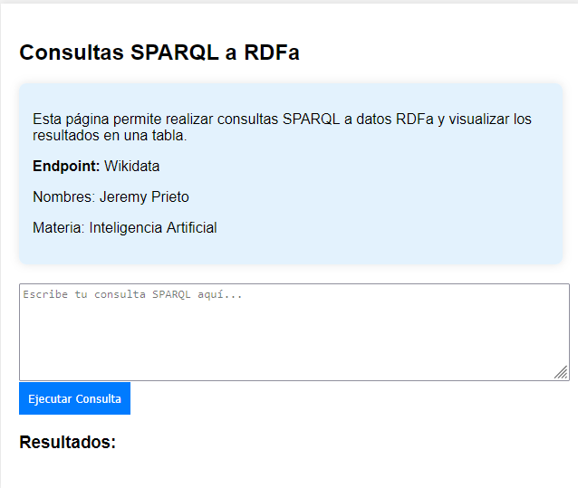

## SPARQL Query Interface for Wikidata

This project provides a simple web-based interface to execute SPARQL queries against Wikidata and visualize the results in a table. It is useful for retrieving structured data from Wikidata using SPARQL.

## Features
- Execute SPARQL queries directly from the webpage.
- Display query results in a formatted table.
- Uses Wikidata's public SPARQL endpoint.
- Basic UI for input and output visualization.

## Usage
1. Open `index.html` in a browser.
2. Enter a SPARQL query in the provided textarea.
3. Click **"Ejecutar Consulta"** to fetch results.
4. Results will be displayed in a table format.

## Example Query
To retrieve a list of world capitals and their respective countries, you can use the following query:

```sparql
SELECT ?country ?countryLabel ?capital ?capitalLabel WHERE {
  ?country wdt:P31 wd:Q6256.  # Identifica países
  ?country wdt:P36 ?capital.  # Relaciona el país con su capital
  SERVICE wikibase:label { bd:serviceParam wikibase:language "es". }
}
LIMIT 10
```

## Screenshot
